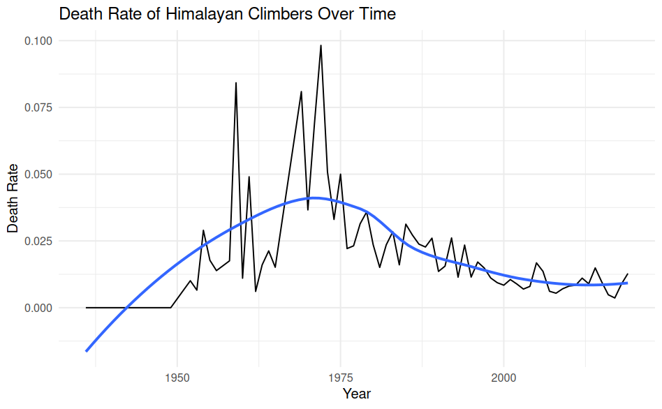

# Analyzing Himalayan Climbing Expeditions with SQL and R

**Group Members:** Laura Henze and Tristan Zook

## Project Overview

In this project, we used SQL and R to analyze historical Himalayan climbing expedition data from the Himalayan Expedition Dataset. Our goal was to investigate patterns in expedition success, climber safety, participation, and staffing.

The project involved:
- Building a relational database
- Importing and cleaning data
- Writing SQL queries
- Visualizing results in R
- Interpreting expedition trends

## Datasets

We worked with three datasets:

- `members`
- `expeditions`
- `peaks`

These datasets were imported into a DuckDB database and linked using expedition and peak identifiers.

## Database Design

The database consisted of three tables:

### Members

Included information such as:

- Age
- Citizenship
- Expedition role
- Success status
- Oxygen use
- Injury status

### Expeditions

Included:

- Year
- Season
- Peak
- Number of members
- Number of hired staff
- Expedition outcome

### Peaks

Included:

- Peak name
- Height
- Climbing status
- First ascent information

## Example SQL Query

One question we investigated was whether climbers using supplemental oxygen were more likely to successfully summit.

```sql
SELECT
  m.oxygen_used,
  COUNT(*) AS total_climbers,
  SUM(CASE WHEN m.success = TRUE THEN 1 ELSE 0 END) AS successes,
  ROUND(
    SUM(CASE WHEN m.success = TRUE THEN 1 ELSE 0 END) * 1.0 /
    COUNT(*),
    3
  ) AS success_rate
FROM members m
GROUP BY m.oxygen_used;
```

This query compared summit success rates between climbers who used supplemental oxygen and those who did not.

## Major Findings

### Success Rates Increased Over Time

We observed a general increase in expedition success rates over the years, likely due to improvements in equipment, training, and expedition planning.

### Oxygen Use Improves Success

Climbers using supplemental oxygen had noticeably higher success rates.

### Death Rates Have Declined

A visualization of annual death rates showed a long-term decrease in climber mortality despite growing expedition participation.

### Nepal Has the Highest Participation

Nepal contributed the largest number of climbers, likely due to both geography and the important role Nepali guides play in Himalayan expeditions.

## Example Visualization



## Skills Developed

- SQL
- Database Design
- Data Cleaning
- Data Visualization
- DuckDB
- R Programming
- Relational Databases
- Scientific Communication

## Reflection

This project helped me develop experience building and querying relational databases while connecting SQL analysis to visualization and interpretation in R. It strengthened my understanding of the complete data analysis workflow from raw data to meaningful conclusions.

## Full Report

[View Full Project Report](sql_project.pdf)
