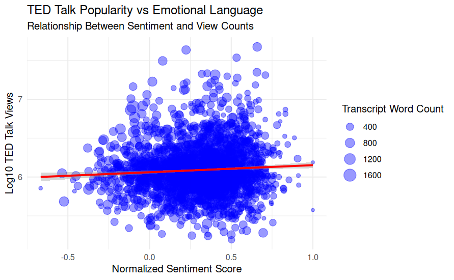
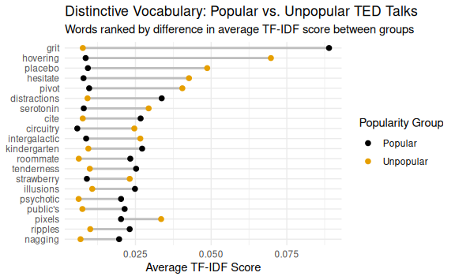

# What Makes a TED Talk Inspiring?

**Group Members:** Laura Henze & Tristan Zook

## Project Overview

In this project, we used natural language processing and text mining techniques in R to investigate patterns within TED Talk transcripts. By combining transcript text with metadata such as view counts, we explored how language use may influence audience engagement.

The analysis focused on two primary questions:

1. Do highly viewed TED Talks use different emotional language than less popular talks?
2. Are certain words or themes more characteristic of popular versus unpopular TED Talks?

---

## Tools Used

- R
- tidytext
- tidyverse
- ggplot2
- Regular Expressions (Regex)
- Sentiment Analysis
- TF-IDF Analysis

---

## Data Sources

The project used two datasets from the Kaggle TED Talks collection.

### TED Main Dataset

Included:

- Speaker names
- Talk titles
- View counts
- Tags
- Publication dates
- Number of comments

### Transcript Dataset

Included:

- Full TED Talk transcripts
- TED Talk URLs

The datasets were joined using TED Talk URLs, allowing transcript text to be analyzed alongside popularity metrics.

---

## Data Preparation

Before analysis, the transcripts were cleaned by:

- Removing stop words
- Removing numbers
- Removing audience cues such as applause
- Retaining laughter markers when relevant
- Tokenizing transcript text into individual words

The cleaned dataset was then used for sentiment analysis and TF-IDF analysis.

---

## Sentiment Analysis and TED Talk Popularity

To investigate emotional language, we applied the NRC sentiment lexicon to classify words into emotional categories.

Positive emotions included:

- Joy
- Trust
- Anticipation
- Surprise

Negative emotions included:

- Fear
- Anger
- Sadness
- Disgust

Each TED Talk received a normalized sentiment score that was compared against total view counts.

### Visualization

{width=85%}

### Interpretation

This visualization explores the relationship between emotional language and TED Talk popularity.

A slight positive relationship emerged between emotional positivity and popularity. Talks containing more optimistic and uplifting language tended to receive somewhat higher view counts on average.

However, the relationship was not especially strong. Many talks with neutral or negative sentiment still achieved high view counts, suggesting that emotional positivity alone does not determine success.

Other factors such as speaker reputation, storytelling ability, topic relevance, production quality, and timing likely play major roles in audience engagement.

---

## TF-IDF Analysis and Popularity Groups

Sentiment analysis captures only part of a transcript's meaning. To investigate differences in word usage more deeply, we performed a TF-IDF analysis.

TED Talks were divided into:

- Most Popular Talks (top 10% by views)
- Least Popular Talks (bottom 50% by views)

TF-IDF scores were used to identify words that were particularly important within one group relative to the other.

### Visualization

{width=85%}

### Interpretation

The dumbbell plot compares the importance of words across popularity groups.

Words that were especially influential in popular talks included:

- grit
- kindergarten
- distractions
- public's
- ripples

Words that were more influential in less popular talks included:

- serotonin
- circuitry
- intergalactic
- pixels
- placebo

These findings suggest that highly viewed TED Talks may rely more heavily on broadly relatable language, while less popular talks often contain more technical or specialized vocabulary.

While these conclusions are somewhat speculative, they provide insight into how communication style may influence audience engagement.

---

## Key Findings

### Emotional Language Matters

Positive sentiment showed a modest association with TED Talk popularity.

### Technical Vocabulary Appears Less Frequently in Viral Talks

Highly viewed TED Talks tended to emphasize language that was accessible to a broader audience.

### Communication Is Multifaceted

Popularity is likely influenced by many factors beyond language alone, including:

- Speaker reputation
- Storytelling ability
- Topic relevance
- Timing
- Production quality

---

## Skills Developed

Through this project, I gained experience with:

- Natural Language Processing (NLP)
- Text Mining
- Sentiment Analysis
- TF-IDF Analysis
- Regular Expressions
- Data Cleaning
- Data Visualization
- Scientific Communication

---

## Reflection

This project demonstrated how computational text analysis can uncover patterns that may not be obvious through casual observation alone. By combining transcript text with audience engagement metrics, we were able to investigate how language, emotion, and communication style interact within one of the world's most influential public speaking platforms.

The project strengthened my skills in data wrangling, visualization, natural language processing, and communicating technical findings to a broader audience.

---

## Full Report

[View Full Project Report](ted_talk_text_analysis.pdf)
---

## Data Source

[TED Talks Dataset (Kaggle)](https://www.kaggle.com/datasets/rounakbanik/ted-talks)
